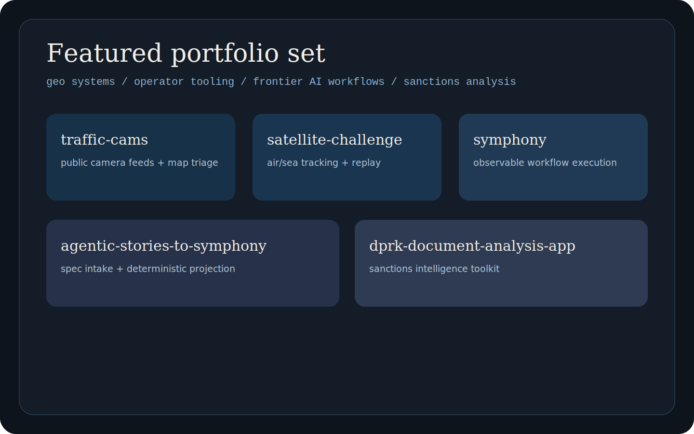

# GitHub Profile Landing

This repo is the front door for the public project set. It exists to help a reviewer understand the work quickly, then choose which repository to inspect next.

## What A Reader Should Learn Fast

- the work is grounded in real software, not concept decks
- the strongest repos are `traffic-cams`, `satellite-challenge`, `symphony`, `agentic-stories-to-symphony`, and `dprk-document-analysis-app`
- the through-line is geospatial systems, monitoring tools, sanctions-analysis tooling, and frontier-AI workflow software

## Featured Repos

### traffic-cams
Open this first for the fastest picture of geospatial product work. It unifies public traffic feeds and turns them into an operator-facing camera review flow.

### satellite-challenge
Open this for the most complete operational dashboard: maritime and aviation tracking with replay and entity-focused review.

### symphony
Open this for workflow runtime design: visibility, verification-aware completion, and safer autonomous execution controls.

### agentic-stories-to-symphony
Open this for spec-first planning and deterministic tracker projection before execution. It shows the planning layer that feeds Symphony runs.

### dprk-document-analysis-app
Open this for defense-adjacent analysis tooling: sanctions-intelligence pipelines with explicit source lineage and analyst-facing outputs.

## Writing Notes

The profile copy should stay plain:

- explain the repo before explaining the portfolio
- use short concrete descriptions
- keep the first screen readable without supporting docs
- avoid synthetic hero language and internal positioning jargon
