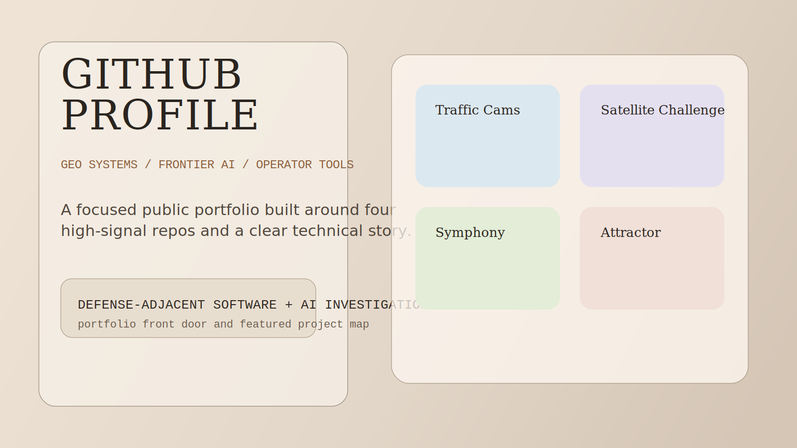

# GitHub Profile Landing

## What This Is

This profile repo is the portfolio entry point for the public project set: geospatial systems, operator interfaces, and frontier-AI workflow investigation.

## Who It Is For

This repo is for recruiters, collaborators, and technical reviewers who need the portfolio story before they dive into the individual repos.

## Why This Exists

A strong GitHub presence is not a dump of unrelated repositories. This profile exists to make the through-line explicit: geo/defense systems work, operator-facing software, and AI orchestration that is built for evaluation and supervision.

## Visual Tour

The featured grid preview shows how the portfolio should feel at first glance: focused, coherent, and anchored by a small number of high-signal projects.

## Featured Repos

- `traffic-cams`
- `satellite-challenge`
- `symphony`
- `attractor`

## Repo Signals

- concise identity statement
- four clearly framed flagship projects
- public-safe contact placeholders
- reusable project blurbs for the final profile page
